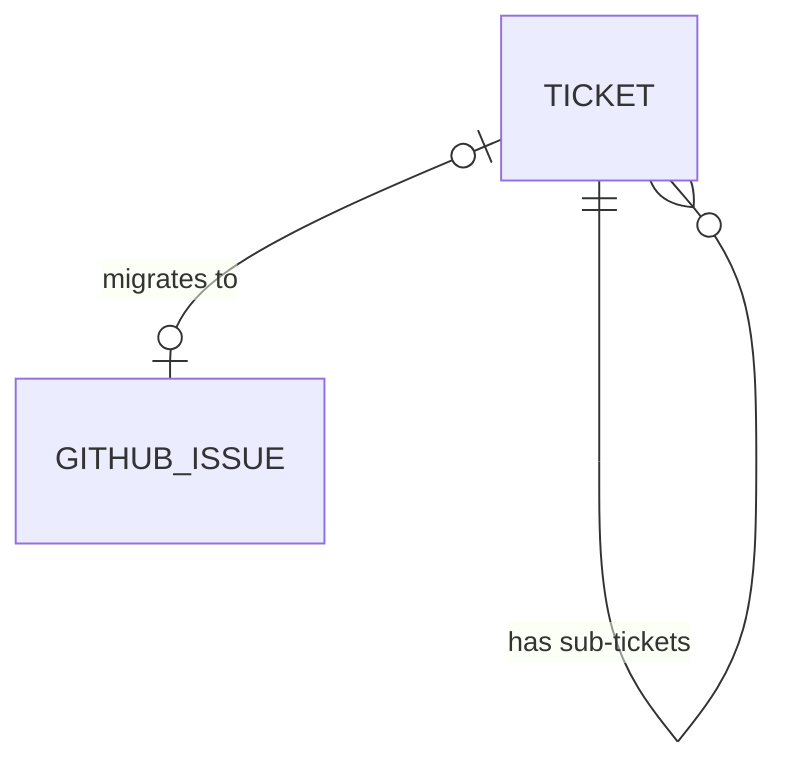

# my-skill

The kanban board (`kanban/`) tracks work items flowing through this repo's
own spec-to-QA pipeline, local-first with optional GitHub backing.

## Language

**Ticket**:
A unit of work tracked on the kanban board, moving through the pipeline
`open → in-progress → review → qa → done`. Created either standalone (a bug
or chore) or as part of a feature breakdown (one parent Ticket + several
sub-Tickets, one per implementable layer). Stored as a `.md` file under
`tickets/` — that file is the Ticket's source of truth regardless of
whether it's also linked to GitHub.
_Avoid_: Issue (reserve for the GitHub-side object specifically), Task, Item

**GitHub-linked Ticket**:
A Ticket that has been migrated — a matching GitHub issue exists and the
Ticket carries its URL. From migration onward, GitHub holds the
authoritative detail (acceptance criteria, definition of done); the local
Ticket keeps only its original description plus a link. Distinct from a
plain Ticket, whose local body is the only copy of the detail that exists.
_Avoid_: Synced ticket (implies two-way sync, which does not happen)

**Migration**:
The one-way move of a Ticket's authoritative detail from local-only to
GitHub: a GitHub issue is created from the Ticket's current content, then
the local Ticket collapses to its short description plus a link. Not
reversible, and not repeated — a migrated Ticket does not pull further
edits back from GitHub.
_Avoid_: Sync, Push (both imply a repeatable, two-way operation)

## Model

model-version: 1

