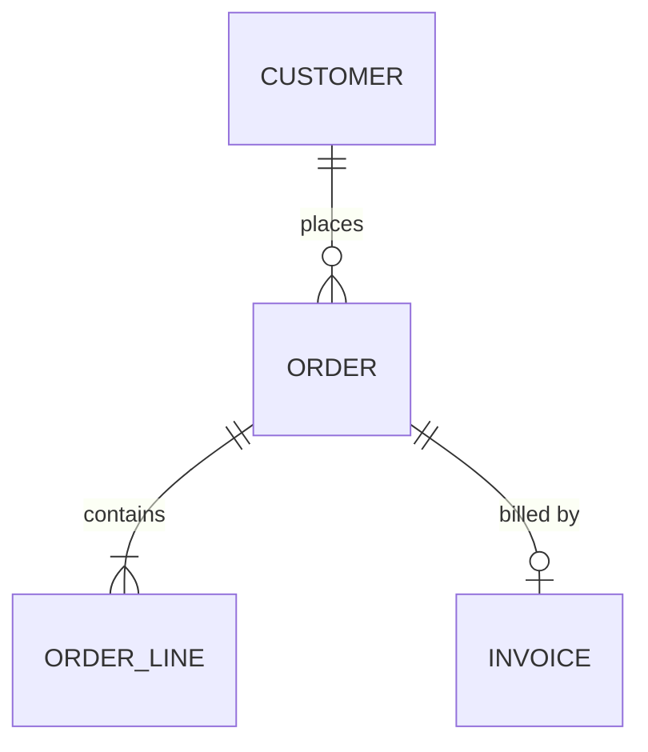

# CONTEXT.md Format

## Structure

```md
# {Context Name}

{One or two sentences on what this context is and why it exists.}

## Language

**Order**:
A customer's request for goods, from submission through fulfilment.
_Avoid_: Purchase, transaction

**Invoice**:
A request for payment sent to a customer after delivery.
_Avoid_: Bill, payment request

**Customer**:
A person or organization that places orders.
_Avoid_: Client, buyer, account

## Model


```

## The Model section

The conceptual ERD: which entities exist and how they relate. **Entities and
relationships only — no columns, no types, no keys.** Those are physical, they
belong in the schema, and `ERD.md` is generated from there. A hand-drawn column
list is a second source of truth that starts lying the first time someone adds
a field.

Write `model-version: n` at the top of `## Model` and bump it whenever an
entity or relationship is added, removed, or changed. PRDs record the
`model-version` they were written against, so a bump is the signal that older
PRDs may need a second look — without it, a model change silently invalidates
every PRD written before it.

Every entity in the diagram must have a definition under `## Language`, and
every term under `## Language` that is a *thing* (rather than a state, event, or
qualifier) must appear in the diagram. A term defined but never placed is a term
nobody knows where to put.

Cardinality is a domain decision, not a drawing detail — `||--o|` versus
`||--|{` says whether an Order can exist without an Invoice, and whether it can
have several. Settle each one with the user rather than defaulting.

## Rules

- **Be opinionated.** When several words exist for one concept, pick the best and put the rest under `_Avoid_`. A glossary that lists synonyms without choosing has not done its job.
- **Keep definitions tight.** One or two sentences. Define what it *is*, not what it does.
- **Only terms specific to this context.** General programming concepts — timeouts, error types, utility patterns — don't belong even if the project leans on them. Before adding: is this unique to this business, or is it just programming? Only the former.
- **Group under subheadings** when natural clusters emerge. A flat list is fine when every term belongs to one cohesive area.
- **Name the near-misses.** When two terms are genuinely different but easily confused, say what separates them inside the definition ("distinct from Shipment, which is one physical dispatch — an Order may span several"). That sentence prevents more bugs than the definition itself.

## Single vs multi-context repos

**Single context (most repos):** one `CONTEXT.md` at the root.

**Multiple contexts:** a `CONTEXT-MAP.md` at the root lists the contexts, where they live, and how they relate:

```md
# Context Map

## Contexts

- [Ordering](./src/ordering/CONTEXT.md) — receives and tracks customer orders
- [Billing](./src/billing/CONTEXT.md) — generates invoices and processes payments
- [Fulfillment](./src/fulfillment/CONTEXT.md) — manages warehouse picking and shipping

## Relationships

- **Ordering → Fulfillment**: Ordering emits `OrderPlaced`; Fulfillment consumes it to start picking
- **Fulfillment → Billing**: Fulfillment emits `ShipmentDispatched`; Billing consumes it to generate invoices
- **Ordering ↔ Billing**: shared types for `CustomerId` and `Money`

## Shared terms

Terms meaning the same thing in more than one context, and the canonical
definition all of them defer to:

- **Customer** — defined in [Ordering](./src/ordering/CONTEXT.md); Billing and
  Fulfillment reference by `CustomerId` and do not redefine it.
```

That last section is what stops each context quietly growing its own version of a shared entity.

## Which structure applies

- `CONTEXT-MAP.md` exists → read it to find the contexts
- Only a root `CONTEXT.md` → single context
- Neither → create a root `CONTEXT.md` lazily when the first term resolves

With multiple contexts, infer which one the current topic belongs to. If it's unclear, ask — a term filed in the wrong context is worse than one not filed at all.
